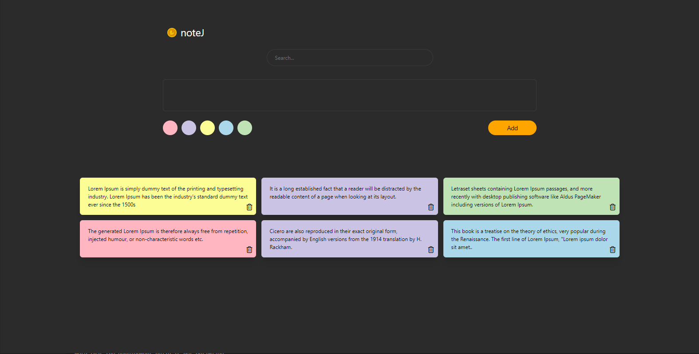

# noteJ




## Description 

**noteJ is a note app developed using React Redux.**

## Setup

1) The client must be run using:

    ```cmd
    > npm install
    > npm run start
    ```

## Acknowledgements

- This project was developed for the Patika.dev Redux course.

## Contact

Created by [@Abdullah Böğrek](https://tr.linkedin.com/in/abdullah-s-bogrek) - feel free to contact me!

Mail: asbogrek@gmail.com

## License

This project is open source and available under the [MIT](https://opensource.org/licenses/MIT).
